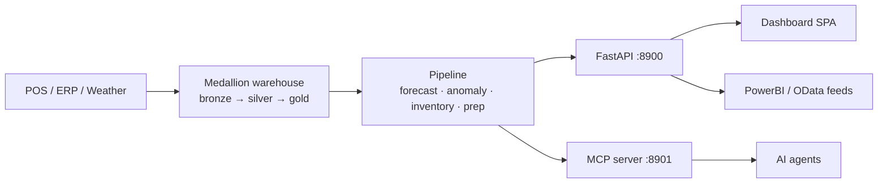

# Documentation

Everything you need to understand, run, deploy, and operate the **KFC Vietnam Sales
Forecasting & Anomaly Platform**. Start with whichever doc matches your task.

| Doc | Read it when you want to… |
|-----|---------------------------|
| [setup.md](setup.md) | Run the platform locally on your laptop (zero infrastructure). |
| [architecture.md](architecture.md) | Understand how the pieces fit — data flow, medallion warehouse, forecast engine, services. |
| [deployment.md](deployment.md) | Ship it to the GPU server (192.168.50.85) with Docker + Postgres + Chronos‑2. |
| [networking.md](networking.md) | Know the ports, hosts, firewall rules, and how data enters/leaves the system. |
| [usage.md](usage.md) | Use the dashboard, the API, the MCP tools, and the BI feeds day‑to‑day. |
| [how-to.md](how-to.md) | Follow step‑by‑step recipes for common tasks (add data, re‑run, approve users, switch backend…). |

## The platform in one paragraph

Restaurant POS data lands in a **medallion warehouse** (bronze → silver → gold). A
nightly **pipeline** forecasts demand per store × item with **Chronos‑2** (GPU) or a
zero‑dependency **seasonal** fallback, detects **anomalies** (validated by a multi‑judge
council), and turns forecasts into **buying** and **prep** plans. Everything surfaces
through an 11‑page **dashboard**, a natural‑language **Ask** interface, an **MCP** server
for agents, an **AI report**, and **PowerBI/OData** feeds — behind **RBAC** and full
**EN/VI** localization with VND formatting.

## Conventions used in these docs

- **`SF_*`** — every runtime setting is an environment variable (see [setup.md](setup.md#configuration-reference)).
- **Local vs Server** — the *same code* runs on SQLite + seasonal locally and Postgres + Chronos‑2 on the server; only env vars differ.
- Diagrams are written in [Mermaid](https://mermaid.js.org/) and render automatically on GitHub.
