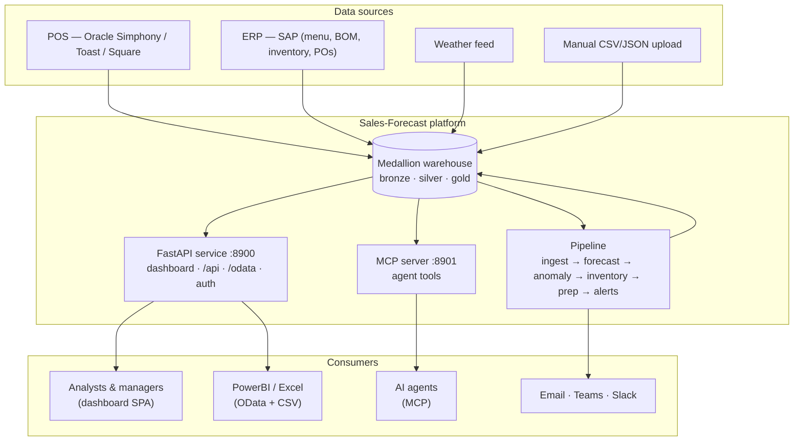
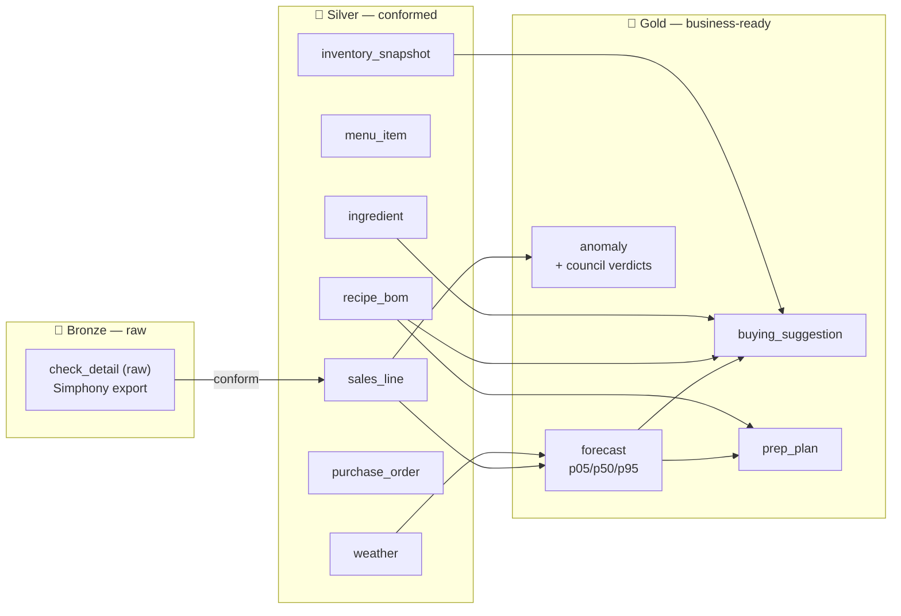
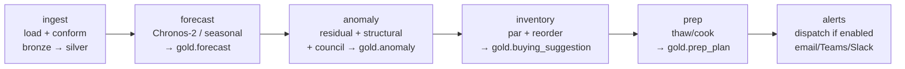
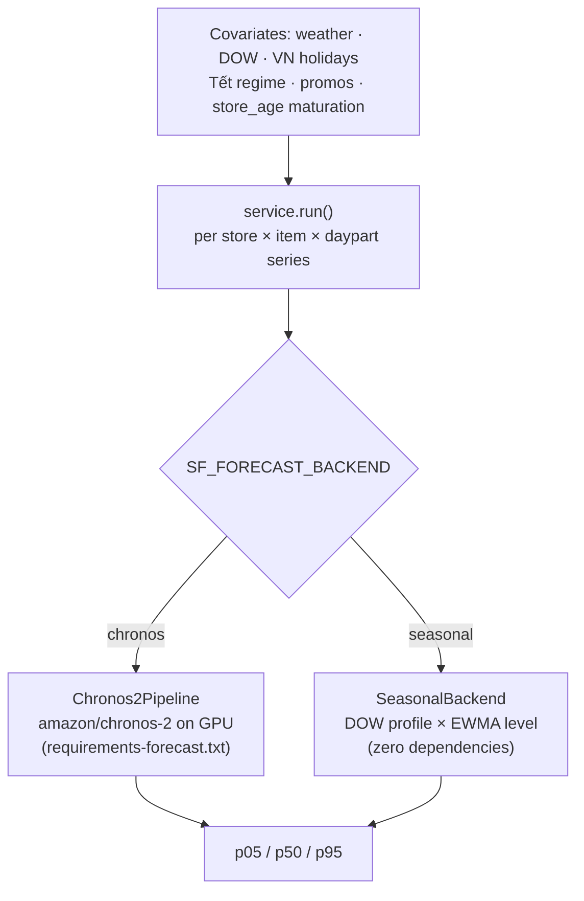
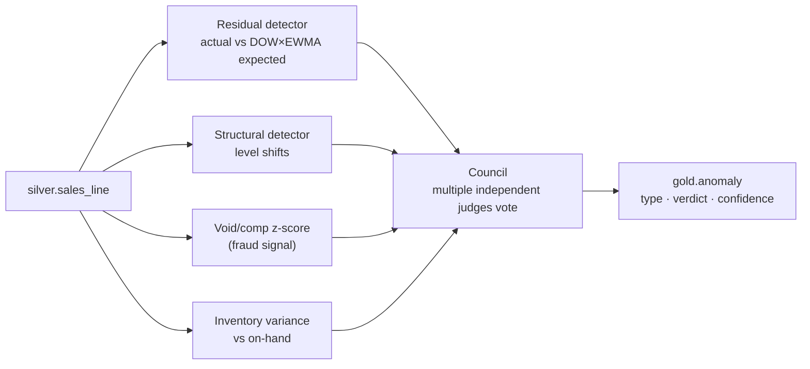
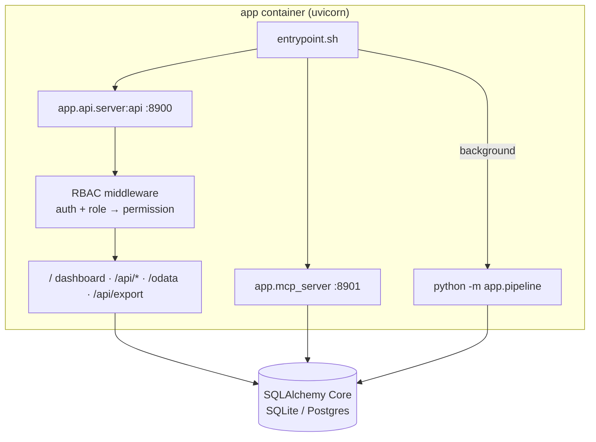

# Architecture

How the platform is put together: the data flow from POS to plan, the medallion
warehouse, the forecast engine, and the runtime services. Every diagram below is
Mermaid and renders on GitHub.

## 1. System context

## 2. The medallion warehouse

Data is refined in three layers. Bronze is raw as‑received; silver is the conformed
canonical model; gold is the analytics/plan output the app reads. This is the same
bronze→silver→gold pattern used across the data platform, stored today as tables in
SQLite/Postgres over a mounted `data/` volume (MinIO‑ready if object storage is added).

The lineage graph (layer, source, freshness, row counts) is exposed live at
`/api/lineage` and rendered on the dashboard's **Data lineage** page.

## 3. The batch pipeline

`python -m app.pipeline` runs the stages in order. `run_all()` first drops & rebuilds
the gold output tables, so every run is a clean, reproducible rebuild. Any single stage
can be run alone (`python -m app.pipeline forecast`).

| Stage | Module | Produces |
|-------|--------|----------|
| ingest | `app.ingest.load` + `conform` | silver tables + a validation report |
| forecast | `app.forecast.service` | `forecast` (p05/p50/p95 per store×item×daypart) |
| anomaly | `app.anomaly.detect` + `app.council` | `anomaly` with type + council verdict/confidence |
| inventory | `app.inventory.planning` | `buying_suggestion` (par, reorder point, qty, cost) |
| prep | `app.inventory.prep` | `prep_plan` (thaw/cook lead‑time plan) |
| alerts | `app.alerts` | notifications (only if a rule is enabled) |

## 4. The forecast engine (pluggable backend)

The forecaster is swappable behind one contract: given history + future covariates,
return `p05/p50/p95` per series. `SF_FORECAST_BACKEND` selects the implementation, so
the exact same pipeline, charts, backtest, and anomaly band work on either.

- **Chronos‑2** — the production model (GPU). Pinned to an idle GPU on the server to
  avoid contention with other workloads (see [deployment.md](deployment.md#gpu-selection)).
- **Seasonal** — the always‑available fallback: a day‑of‑week profile scaled by an EWMA
  level. No torch, no GPU; used for local dev and as a safety net.
- **Backtest / hindcast** (`app.forecast.backtest`) holds out the last *N* days, forecasts
  them, and scores MAE / MAPE / band‑coverage / skill‑vs‑naive / bias — this powers the
  Forecast page's "Backtest vs actual" overlay.

## 5. Anomaly detection + council

A candidate anomaly is only surfaced with high confidence when the **council** (a panel
of independent checks, optionally LLM‑assisted) agrees. Types: spike, drop, outage,
fraud, inventory.

## 6. Runtime services & request flow

- **One FastAPI app** serves the SPA (`/`), the JSON API (`/api/*`), the PowerBI feeds
  (`/odata`, `/api/export/*`), and the auth endpoints.
- **RBAC middleware** runs on every request: it resolves the session cookie to a user,
  then enforces the role→permission map (open routes and static assets are exempt).
- **Database access** is always through `app/db.py` (SQLAlchemy Core). pandas'
  `to_sql`/`read_sql` are bypassed on purpose — their SQLAlchemy detection is broken in
  this environment — so all reads/writes go through the thin `db.read_sql` / `db.write_df`
  wrappers, which work identically on SQLite and Postgres.

## 7. Key design decisions

| Decision | Why |
|----------|-----|
| **Env‑switched backends** (SQLite/Postgres, seasonal/Chronos) | One codebase runs on a laptop and on the GPU server unchanged. |
| **Pluggable forecaster behind a p05/p50/p95 contract** | Chronos‑2 and the fallback are interchangeable; downstream never changes. |
| **Rebuild‑from‑scratch pipeline** | Deterministic, reproducible gold tables; no incremental‑state drift. |
| **Single‑file vanilla‑JS SPA** (no build step, self‑contained SVG charts) | Zero front‑end toolchain; served straight from disk; trivial to deploy. |
| **SQLAlchemy Core, pandas bypassed for I/O** | Works around a pandas 3.0 I/O bug; portable across SQLite/Postgres. |
| **Bind‑mounted code + data** | A dashboard/code change is an rsync away — no image rebuild for content. |

## Related docs

- Ports, hosts, and data ingress/egress → [networking.md](networking.md)
- How to deploy this to the server → [deployment.md](deployment.md)
- How to use each surface → [usage.md](usage.md)
