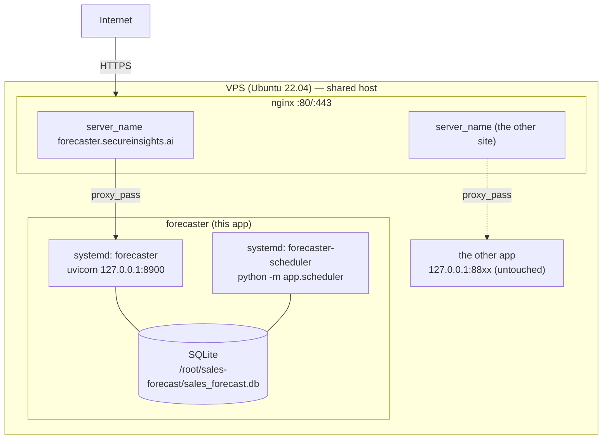

# Native deployment (systemd + nginx + Let's Encrypt)

How the platform is deployed to **https://forecaster.secureinsights.ai** — a native
install (Python venv + systemd) behind nginx with a Let's Encrypt certificate, running
**alongside another live app on the same host without interfering with it**.

Use this when the target host has **no GPU worth using** and **no Docker**, and already
runs nginx for other sites. For the containerized GPU deployment, see
[deployment.md](deployment.md).

## Topology



## Why these choices (isolation)

The host runs a live application already. The forecaster is kept fully isolated:

| Dimension | Isolation |
|-----------|-----------|
| **Ports** | forecaster on `127.0.0.1:8900/8901`; never collides with the other app's ports |
| **Database** | **SQLite** — its own file, no shared DB server |
| **Compute** | **seasonal** forecaster on CPU — the small/shared GPU is never touched |
| **Filesystem** | everything under `/root/sales-forecast` |
| **nginx** | a **separate** server-block file; the other site's config is never edited; `nginx -t` before every reload |
| **TLS** | `certbot` scoped to `-d forecaster.secureinsights.ai` only |

Result: deploying (or restarting) the forecaster cannot affect the co-hosted site.

## Prerequisites on the host

- Ubuntu, `python3` (3.10+), `git`, `nginx`, `certbot` (with the nginx plugin), `ufw` allowing 80/443.
- DNS: **`forecaster.secureinsights.ai` → the host's public IP** must resolve *before* running certbot.

## Steps

### 1. Sync the code (no data, no venv, no secrets)

From your workstation:

```bash
rsync -az --exclude '.git' --exclude 'data' --exclude '*.db' --exclude '__pycache__' \
  --exclude '.venv' --exclude 'deploy/.env' --exclude '*.pptx' --exclude 'documents/pptx-workspace' \
  ./ root@<host>:/root/sales-forecast/
```

### 2. Virtualenv + core dependencies (no torch/Chronos)

```bash
ssh root@<host>
cd /root/sales-forecast
python3 -m venv .venv
.venv/bin/pip install --upgrade pip
.venv/bin/pip install -r requirements.txt        # NOT requirements-forecast.txt
```

### 3. Generate data + build the warehouse (SQLite + seasonal)

```bash
.venv/bin/python data_generator/generate_pos_data.py
.venv/bin/python -m app.pipeline                 # ~2 min on CPU; builds sales_forecast.db
```

### 4. systemd services (localhost-bound)

Copy the two unit files from [`deploy/native/`](../deploy/native) and enable them:

```bash
cp deploy/native/forecaster.service           /etc/systemd/system/
cp deploy/native/forecaster-scheduler.service /etc/systemd/system/
systemctl daemon-reload
systemctl enable --now forecaster forecaster-scheduler
systemctl is-active forecaster forecaster-scheduler          # -> active  active
curl -s http://127.0.0.1:8900/api/health                     # -> {"status":"ok","backend":"seasonal","database":"sqlite",...}
```

`forecaster` runs uvicorn (dashboard + API + the demo virtual agent thread); it binds
`127.0.0.1` so the app is reachable **only** through nginx. `forecaster-scheduler` runs
the intra-day anomaly detector + health refresh. Both `Restart=always` and are enabled,
so they survive reboots. (An MCP service can be added the same way on `:8901` if needed.)

### 5. nginx server block (its own file)

```bash
cp deploy/native/nginx-forecaster.conf /etc/nginx/sites-available/forecaster.secureinsights.ai
ln -s /etc/nginx/sites-available/forecaster.secureinsights.ai /etc/nginx/sites-enabled/
nginx -t                                    # MUST pass before reloading
systemctl reload nginx
curl -s -H 'Host: forecaster.secureinsights.ai' http://127.0.0.1/api/health   # -> ok
```

### 6. TLS with Let's Encrypt (this domain only)

```bash
certbot --nginx -d forecaster.secureinsights.ai -n --agree-tos --redirect
```

certbot obtains the cert, rewrites **our** server block to add `listen 443 ssl` + the
cert paths + an 80→443 redirect, tests, and reloads. Auto-renewal is scheduled.

### 7. Verify (and confirm the co-hosted site is unaffected)

```bash
curl -s https://forecaster.secureinsights.ai/api/health          # 200, ok
curl -s -o /dev/null -w '%{http_code}\n' http://forecaster.secureinsights.ai/   # 301 -> https
curl -s -o /dev/null -w '%{http_code}\n' https://<the-other-site>/              # still 200
```

## Operating it

```bash
systemctl restart forecaster                 # reload after a code change (rsync first)
journalctl -u forecaster -f                  # tail logs
journalctl -u forecaster-scheduler -f
.venv/bin/python -m app.pipeline             # re-run the pipeline (e.g. after new data)
```

To deploy a code change: `rsync` the changed files, then `systemctl restart forecaster`
(and `forecaster-scheduler` if that path changed). The dashboard (`index.html`) is served
from disk, so a dashboard-only change needs no restart.

## Security checklist (public HTTPS)

- [ ] **Change the seeded demo passwords.** `admin/admin` etc. work out of the box and are
      internet-reachable once public. Rotate them (Settings → Users & roles) or:
      `.venv/bin/python -c "from app import auth; auth.upsert_user('admin','admin',password='<STRONG>')"`
- [ ] **Disable open sign-up** if you don't want pending accounts.
- [ ] **LLM key** (optional): add it in Settings → LLM endpoint. The Ask SQL is sandboxed
      (SELECT-only, allow-listed tables) but a **read-only DB role** is good defense-in-depth.
- [ ] TLS is handled by certbot auto-renew; confirm `systemctl list-timers | grep certbot`.

## Config summary (what differs from the GPU deployment)

| Setting | Native (this) | Docker/GPU ([deployment.md](deployment.md)) |
|---------|---------------|---------------------------------------------|
| `SF_DATABASE_URL` | SQLite (default) | Postgres |
| `SF_FORECAST_BACKEND` | `seasonal` (CPU) | `chronos` (GPU) |
| Process manager | systemd | Docker Compose |
| TLS | nginx + certbot | put a TLS proxy in front |
| `SF_DEMO_AGENT` | `1` (virtual store agent for the demo) | `1` |
