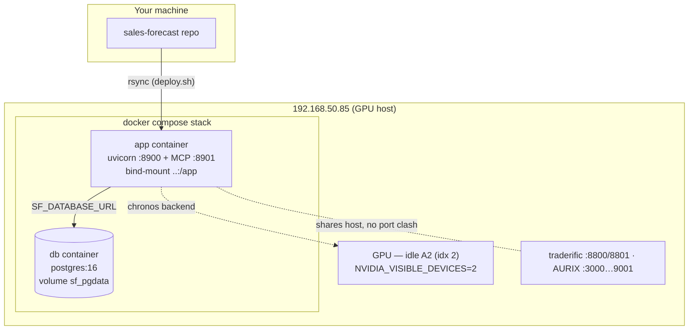
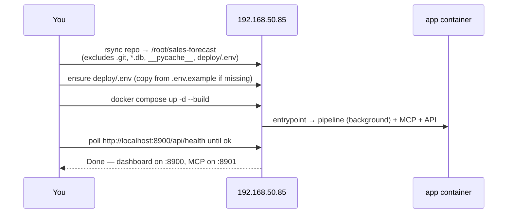
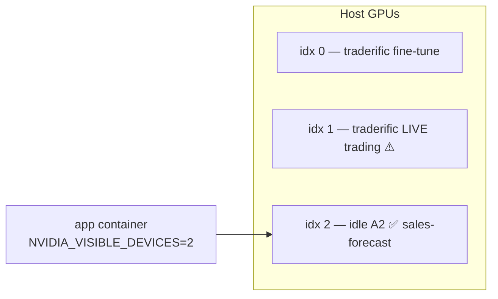

# Deployment

How to ship the platform to the GPU server (**192.168.50.85**), running as a Docker
Compose stack with a bundled Postgres and — optionally — the real Chronos‑2 backend on
GPU. It runs alongside other workloads on the same host (traderific, AURIX) on
non‑overlapping ports.

## Topology



## One‑command deploy

The repo ships `deploy/deploy.sh`, which rsyncs the code, ensures `deploy/.env`, and
brings the stack up:

```bash
./deploy/deploy.sh
```

What it does:



Override the target with env vars if needed:

```bash
SF_DEPLOY_HOST=root@192.168.50.85 SF_DEPLOY_DIR=/root/sales-forecast ./deploy/deploy.sh
```

## First‑time configuration

Before the first deploy, set real secrets in `deploy/.env` on the host (never commit
this file — it is gitignored):

```ini
# deploy/.env  (copy from deploy/.env.example)
POSTGRES_DB=salesforecast
POSTGRES_USER=sf_user
POSTGRES_PASSWORD=<a-strong-password>

SF_FORECAST_BACKEND=seasonal      # or "chronos" once the GPU overlay is installed
SF_CHRONOS_DEVICE=cpu             # e.g. cuda:0 when backend=chronos
SF_FORECAST_HORIZON=14

SF_MCP_TOKEN=<random-bearer-token>   # clients must present this to the MCP endpoint
```

The compose file reads these; `docker-compose.yml` maps them onto the container's
`SF_*` environment and builds `SF_DATABASE_URL` for Postgres automatically.

## The container stack

`deploy/docker-compose.yml` defines two services:

| Service | Image | Purpose | Notes |
|---------|-------|---------|-------|
| `db` | `postgres:16` | Bundled warehouse | Data persists in the named volume `sf_pgdata`; has a healthcheck the app waits on. |
| `app` | built from `deploy/Dockerfile` | API + dashboard + MCP + pipeline | Bind‑mounts the repo (`..:/app`) so code/data/dashboard updates need no rebuild. |

Ports published to the host: **8900** (API + dashboard) and **8901** (MCP).

### What the entrypoint does

`deploy/entrypoint.sh` (mode `serve`, the default):

1. Launches `python -m app.pipeline` in the **background** so the UI comes up
   immediately (the first Chronos run loads the model and forecasts ~200 series, which
   takes a few minutes; data fills in as it completes — watch `/tmp/pipeline.log`).
2. Starts the **MCP server** on `:8901`.
3. Starts **uvicorn** (API + dashboard) on `:8900` in the foreground.

Run it in pipeline‑only mode (no server) with the `pipeline` argument.

## GPU selection

Chronos‑2 is an **opt‑in overlay** — it is *not* baked into the base image, keeping it
small and CPU‑portable. To enable it:

1. Set `SF_INSTALL_FORECAST=true` so the build installs `requirements-forecast.txt`
   (torch + chronos‑forecasting), and uncomment the GPU `deploy.resources` block in the
   compose file.
2. In `deploy/.env`: `SF_FORECAST_BACKEND=chronos` and `SF_CHRONOS_DEVICE=cuda:0`.
3. Re‑deploy: `./deploy/deploy.sh`.

**GPU pinning (important).** The host is shared. `NVIDIA_VISIBLE_DEVICES` restricts which
physical GPU the container sees:



> ⚠️ **Never point this platform at GPU idx 1** — traderific runs **live real‑money
> trading** there. Chronos‑2 is pinned to the idle A2 (idx 2) so there is zero
> contention. Confirm the mapping in `deploy/.env` before enabling the GPU backend.

## Deploying a content‑only change (fast path)

Because the repo is bind‑mounted (`..:/app`) and the API serves the dashboard fresh from
disk (`FileResponse`), a change to `index.html` (or any file that isn't a dependency or
the entrypoint) does **not** need a rebuild — just sync the file:

```bash
rsync -az app/dashboard/index.html root@192.168.50.85:/root/sales-forecast/app/dashboard/index.html
# verify it's live:
curl -s http://192.168.50.85:8900/ | grep -c helpbtn
```

Use the full `deploy.sh` when you change Python dependencies, the Dockerfile, or the
entrypoint.

## Operating the deployed stack

```bash
# Re-run the pipeline on the host any time (nightly refresh is a cron/systemd timer):
ssh root@192.168.50.85 "cd /root/sales-forecast && \
  docker compose -f deploy/docker-compose.yml exec app python -m app.pipeline"

# Tail logs
ssh root@192.168.50.85 "cd /root/sales-forecast && docker compose -f deploy/docker-compose.yml logs -f app"

# Watch the initial/background pipeline
ssh root@192.168.50.85 "docker compose -f /root/sales-forecast/deploy/docker-compose.yml exec app tail -f /tmp/pipeline.log"

# Restart / stop
ssh root@192.168.50.85 "cd /root/sales-forecast && docker compose -f deploy/docker-compose.yml restart app"
```

> ⚠️ **Don't run two pipelines at once.** A container restart re‑runs the pipeline in the
> background (via the entrypoint). Don't also trigger the UI/`/api/pipeline/run` job at
> the same time — two concurrent `run_all()` calls both drop & rebuild the gold tables
> and will conflict.

## Verifying a deploy

```bash
curl -s http://192.168.50.85:8900/api/health
# → {"status":"ok","backend":"chronos","database":"postgres"}
```

`backend` and `database` confirm which forecaster and store the running container is
actually using.

## Production hardening checklist

- [ ] **Change demo passwords.** Seeded accounts ship with password = username. Rotate
      them (or delete all but a real admin) before real use — see
      [how-to.md](how-to.md#manage-users--approve-a-sign-up).
- [ ] **Put TLS in front.** The stack serves plain HTTP on the LAN, so RBAC credentials
      and the MCP bearer token travel in cleartext. Front it with a TLS reverse proxy
      (nginx/Caddy) for anything beyond a trusted LAN — same posture as traderific.
- [ ] **Set a strong `POSTGRES_PASSWORD` and `SF_MCP_TOKEN`** in `deploy/.env`.
- [ ] **Restrict exposure.** 8900/8901 are LAN ports; don't expose them to the internet
      without the TLS proxy and auth in place (see [networking.md](networking.md)).
- [ ] **Confirm GPU pinning** (`NVIDIA_VISIBLE_DEVICES=2`) if the Chronos backend is on.

## Related docs

- Ports, firewall, and data flow → [networking.md](networking.md)
- What's inside the stack → [architecture.md](architecture.md)
