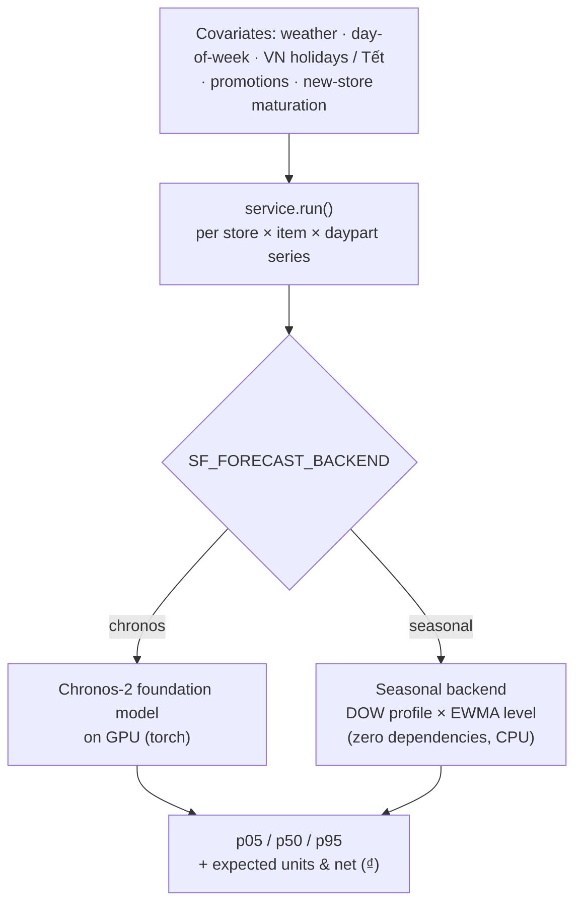
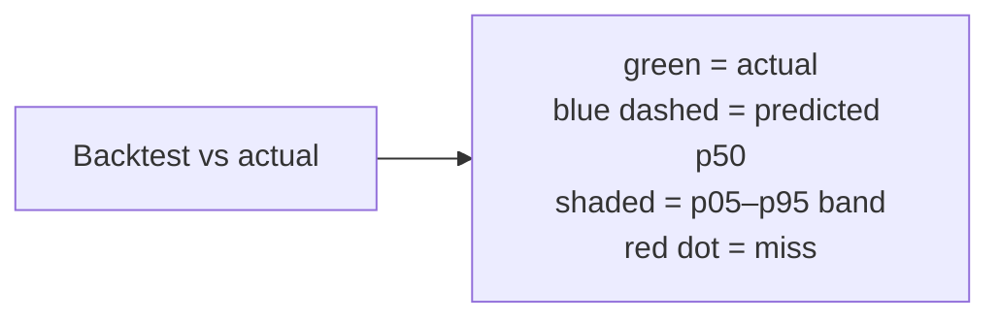
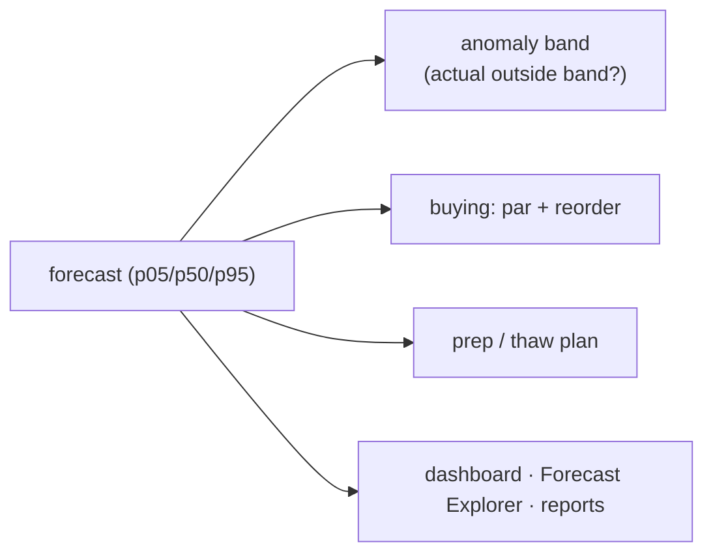

# Forecasting

How the platform predicts demand: a pluggable time-series engine, the restaurant
covariates that drive it, the probabilistic output, how accuracy is measured, and how to
read it in the app. Code lives in `app/forecast/`.

## The engine is pluggable — same contract, two backends

Every forecast is produced behind one contract: *given a series' history + known-future
covariates, return `p05 / p50 / p95` per day.* `SF_FORECAST_BACKEND` picks the
implementation, so the entire pipeline, UI, backtest, and anomaly band work identically
on either.

| Backend | What it is | When |
|---------|-----------|------|
| **chronos** | A machine-learning **time-series foundation model** (Chronos-2), runs on a GPU via PyTorch (`requirements-forecast.txt`). | Production host with a real GPU. |
| **seasonal** | A day-of-week profile scaled by an EWMA level — **zero dependencies, CPU-only**. | Local dev, and any host without a usable GPU (e.g. the native deploy). Same p05/p50/p95 contract. |

Both are honest probabilistic forecasts; only the accuracy differs. This is why the
platform can run on a laptop and on a GPU server with only an environment-variable change.

## Covariates — restaurant demand is driven, not random

`app/forecast/features.py` builds a covariate frame per series. Restaurant demand is
highly covariate-driven, so these are first-class:

- **Weather** — temperature and rain (per-item betas); future weather uses region ×
  day-of-year **climatology** as a stand-in for a live forecast feed.
- **Day-of-week & weekend** — encoded as `dow_sin/cos` + a weekend flag.
- **Vietnam holidays & retail driver days** — a `holiday_flag`, including **Tết as a
  multi-week regime** (pre-Tết spike → quiet during the holiday → rebound) plus Women's
  Days, Children's Day, Teachers' Day, Mid-Autumn, etc.
- **Promotions** — known-future promo flags from the promo calendar.
- **New-store maturation** — a `store_age` covariate; a new store ramps from ~55% to 100%
  over its first year, so the model doesn't judge a 2-month-old store like a 3-year-old one.

Toggle with `SF_USE_COVARIATES` (default on).

## Output — a range, not a single number

For each **store × item × daypart × day** the `forecast` table stores:

| Field | Meaning |
|-------|---------|
| `p50` | the expected / most-likely demand |
| `p05` · `p95` | the low / high bounds — a **90% band** (5% chance below p05, 5% above p95) |
| `expected_units` · `expected_net` | expected units and revenue (₫) |

A **wider band = more uncertainty**. The band is also what powers anomaly detection: an
actual outside p05–p95 is a candidate anomaly.

Horizon and history are configurable: `SF_FORECAST_HORIZON` (default **14 days**),
`SF_FORECAST_LOOKBACK` (365), `SF_MIN_HISTORY_DAYS` (90 — a series needs this much history
to be forecastable).

## Measuring accuracy — the backtest

`app/forecast/backtest.py` scores the model by **walk-forward hindcasting**: hold out the
last *N* days, forecast them from data up to the cutoff, and compare to the held-out
actuals.

| Function | Grain | Reports |
|----------|-------|---------|
| `run()` | store × item × daypart | MAE, MAPE, RMSE, band coverage, **skill vs. naive**, bias |
| `run_store_daily()` | **store × day** (aggregated) | MAPE at the grain the target is defined at → **9.1%** (target ≤ 10%) |
| `hindcast_series()` | one series | per-day predicted band vs. actual, for the chart overlay |

**Metric glossary:**

| Metric | Means | Good |
|--------|-------|------|
| **MAE** | average units the forecast is off | lower |
| **MAPE** | same error as a % of actual | lower (≈ 20% at item grain, **9.1%** at store-daily) |
| **Band coverage** | % of actual days that landed inside p05–p95 | ≈ **90%** (the band is honest) |
| **Skill vs. naive** | % less error than a "same as last week" guess | positive = the model adds value (**+36%**) |
| **Bias** | average signed error (over/under-forecast) | near **0** |

## Reading it in the app — the Forecast Explorer

Open the **Forecast** page and pick **Store · Item · Daypart · View**:

- **View = "Forecast (next 14 d)"** — the *future* prediction: the blue **p50** line inside
  the shaded **p05–p95** band. There are no actuals here — those days haven't happened.
- **View = "Backtest vs actual"** — holds out the last 14 days of *real* data, forecasts
  them, and overlays the **actual** line (green; red dots = days that fell outside the
  band) against the predicted p50 (blue dashed) + band. This is where you see *"did the
  forecast land?"* — with the accuracy tiles (MAE / MAPE / band coverage / skill / bias).

**Workflow:** check *Backtest vs actual* first — if the green line tracks the band well for
that item, trust the forward *Forecast* view for planning (staffing, buying, prep).

The dashboard trend chart and the executive report use the same forecasts (90-day actual +
14-day forecast continuation). Buying and prep plans are derived from them via each item's
recipe (BOM).

## How the forecast flows downstream

## Configuration reference

| Variable | Default | Purpose |
|----------|---------|---------|
| `SF_FORECAST_BACKEND` | `seasonal` | `chronos` (GPU) or `seasonal` (CPU) |
| `SF_CHRONOS_MODEL_ID` | `amazon/chronos-2` | model id for the chronos backend |
| `SF_CHRONOS_DEVICE` | `cuda` | `cuda` \| `cuda:0` \| `cpu` |
| `SF_FORECAST_HORIZON` | `14` | days ahead |
| `SF_FORECAST_LOOKBACK` | `365` | days of history fed |
| `SF_USE_COVARIATES` | `true` | weather/holiday/promo/store-age covariates |
| `SF_MIN_HISTORY_DAYS` | `90` | minimum history before a series is forecastable |

## Related

- Architecture overview → [architecture.md](architecture.md#4-the-forecast-engine-pluggable-backend)
- Reading the accuracy tiles in context → [usage.md](usage.md#reading-the-forecast-accuracy-metrics)
- Where the forecast feeds → [store-health.md](store-health.md) (anomaly correlation), buying/prep
