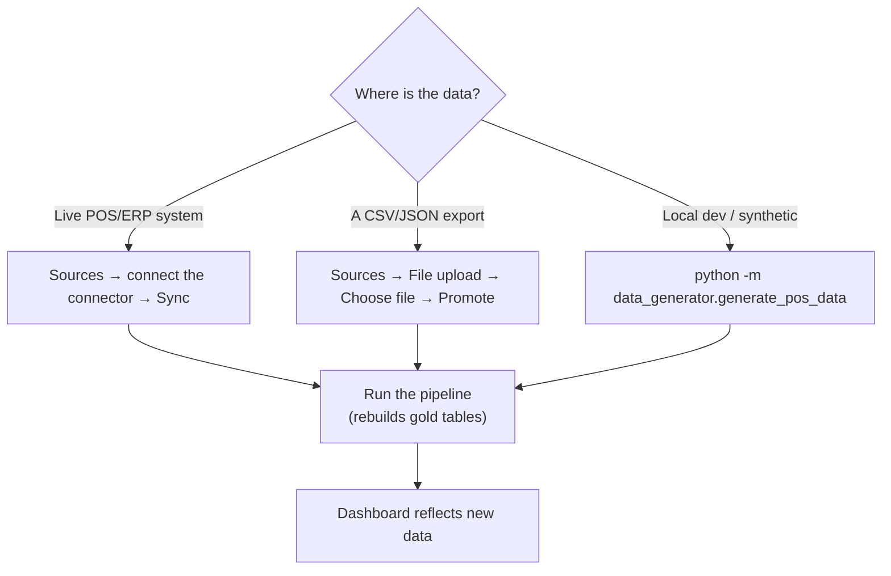
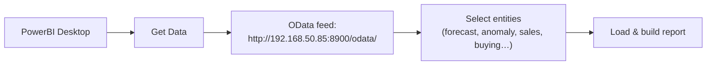

# How‑to (task recipes)

Short, step‑by‑step recipes for the things you'll actually do. Each one links to the
deeper reference when you need it.

- [Add new sales data](#add-new-sales-data)
- [Re‑run the pipeline](#re-run-the-pipeline)
- [Read a forecast and check its accuracy](#read-a-forecast-and-check-its-accuracy)
- [Investigate an anomaly](#investigate-an-anomaly)
- [Get today's buying / prep plan](#get-todays-buying--prep-plan)
- [Connect a data source](#connect-a-data-source)
- [Connect PowerBI](#connect-powerbi)
- [Set up an alert](#set-up-an-alert)
- [Generate a report (incl. the AI report)](#generate-a-report)
- [Manage users / approve a sign‑up](#manage-users--approve-a-sign-up)
- [Switch the forecast backend (seasonal ↔ Chronos‑2)](#switch-the-forecast-backend)
- [Change tuning parameters](#change-tuning-parameters)
- [Deploy a change](#deploy-a-change)
- [Ask the data a question](#ask-the-data-a-question)

---

## Add new sales data

You have three routes depending on the source:



1. Get the data in (connector sync, file upload, or generator — see below).
2. **Run the pipeline** so forecasts/anomalies/plans rebuild ([next recipe](#re-run-the-pipeline)).
3. Refresh the dashboard.

> The pipeline **drops and rebuilds** the gold tables each run, so new data is fully
> reflected — but don't run two at once.

## Re‑run the pipeline

**Locally:**
```bash
python -m app.pipeline            # all stages
python -m app.pipeline forecast   # one stage: ingest|forecast|anomaly|inventory|prep|alerts
```

**On the server:**
```bash
ssh root@192.168.50.85 "cd /root/sales-forecast && \
  docker compose -f deploy/docker-compose.yml exec app python -m app.pipeline"
```

**From the UI:** Settings (or Sources) → **Run pipeline** — this calls `POST
/api/pipeline/run`; watch progress via `GET /api/pipeline/status`.

> ⚠️ Only one pipeline at a time. A container restart also kicks off a background run —
> don't trigger the UI job on top of it. See [deployment.md](deployment.md#operating-the-deployed-stack).

## Read a forecast and check its accuracy

1. **Forecast** page → pick **Store**, **Item**, **Daypart**.
2. Leave **View = Forecast (next 14d)** to see the future prediction (p50 line + p05–p95
   band). There are no actuals here — those days haven't happened.
3. Switch **View = Backtest vs actual** to hold out the last 14 days of *real* data,
   predict them, and overlay the **actual** (green) line — red dots mark days that fell
   outside the band. Read the accuracy tiles (MAE / MAPE / band coverage / skill‑vs‑naive
   / bias — defined in [usage.md](usage.md#reading-the-forecast-accuracy-metrics)).

> Rule of thumb: check **Backtest vs actual** first. If the green line tracks the band
> well for this item, trust the forward forecast for planning.

## Investigate an anomaly

1. **Anomalies** page → sort by **council confidence** (work high‑confidence first).
2. Read the **type** (spike, drop, outage, fraud, inventory) and the store/item/date.
3. **Click the row** to open the inspector — a context chart of that day vs the normal
   pattern.
4. If real, acknowledge it (UI, or MCP `acknowledge_anomaly(id, confirm=true)`); a
   confirmed anomaly can drive an [alert](#set-up-an-alert).

## Get today's buying / prep plan

1. **Inventory & Buying** page.
2. **Reorder list** = items at/below their reorder point now, with suggested qty and ₫
   cost — these are your action items.
3. **Thaw board** = how much frozen product to pull ahead of time; use it the day before
   a high‑demand day (weekend, holiday).
4. API equivalents: `GET /api/buying`, `GET /api/prep`, `GET /api/prep/thaw`.

## Connect a data source

1. **Sources** page → pick a connector (Oracle Simphony, SAP ERP, Toast, Square, Weather).
2. Fill its config (host/port, tokens — secret fields are stored server‑side).
3. **Sync** — this makes an **outbound** call from the host to that provider, landing data
   in staging (the host needs egress; the provider may need the host on its allow‑list —
   see [networking.md](networking.md#data-ingress--how-data-comes-in)).
4. **Run the pipeline** to promote it through bronze→silver→gold.

For a one‑off file: **File upload** → *Choose file…* → **Promote**.

*(Requires the `operate` permission — manager/admin.)*

## Connect PowerBI



1. PowerBI → **Get Data → OData feed** → `http://192.168.50.85:8900/odata/`.
2. Pick entities and load. (Or **Get Data → Web → CSV** against
   `/api/export/{name}.csv`.)
3. `GET /api/feeds/info` lists the exact entities, CSV URLs, and read‑only Postgres
   details if you prefer a direct DB connection. See
   [usage.md](usage.md#powerbi--bi-feeds).

## Set up an alert

1. **Alerts** page → add a **channel**: an email (SMTP) address or a Teams/Slack
   **webhook URL**.
2. Add a **rule**: pick the trigger (e.g. high‑confidence fraud anomaly) and severity
   threshold, and the channel(s).
3. **Test** the channel before relying on it.
4. Alerts fire during the pipeline's `alerts` stage (only if a rule is enabled). Check
   the **notification log** for delivery status.

> Start strict (high‑severity only) to avoid alert fatigue. *(Requires `operate`.)*

## Generate a report

1. **Reports** page → choose one of the 12 templates → set date/store filters → generate.
2. **Export CSV** (Excel) or **Print** (save as PDF).
3. **AI report** → generates an executive narrative from the same tables. Requires an LLM
   endpoint configured in Settings; without it you still get the data tables.
4. API: `GET /api/report/{name}`, `GET /api/report/{name}.csv`, `GET /api/report/ai`.

## Manage users / approve a sign‑up

1. **Settings → Users & roles** *(admin only)*.
2. A new **Sign up** creates a *pending viewer*. To approve: find the user, set the right
   **role**, and mark **active**.
3. Create/edit/delete users here too. API: `GET/POST /api/auth/users`,
   `POST /api/auth/users/delete`.

> First thing in production: change the seeded demo passwords (password = username) or
> delete all but a real admin. Roles are defined in [usage.md](usage.md#roles--permissions).

## Switch the forecast backend

**Permanent (server):** set in `deploy/.env` and redeploy —
```ini
SF_FORECAST_BACKEND=chronos      # or seasonal
SF_CHRONOS_DEVICE=cuda:0
```
For Chronos you must build with `SF_INSTALL_FORECAST=true` and enable the GPU block; keep
`NVIDIA_VISIBLE_DEVICES=2` (never idx 1). See
[deployment.md](deployment.md#gpu-selection).

**On the fly (agent):** MCP `set_forecast_backend(backend="chronos", confirm=true)`.

**Verify:** `curl -s http://192.168.50.85:8900/api/health` → check the `backend` field.

## Change tuning parameters

Two ways:

- **Runtime, via UI:** Settings page — e.g. anomaly lookback, inventory variance, par
  weeks (backed by `app/settings.py`; some are read by the next pipeline run).
- **Environment, permanent:** set the `SF_*` variable (`deploy/.env` on the server, `.env`
  locally) and re‑run/redeploy. Full list in
  [setup.md](setup.md#configuration-reference).

After a change, re‑run the pipeline and re‑check the Forecast accuracy tiles so you can
tell whether it helped.

## Deploy a change

- **Dashboard/content only** (e.g. `index.html`): rsync the one file — no rebuild:
  ```bash
  rsync -az app/dashboard/index.html root@192.168.50.85:/root/sales-forecast/app/dashboard/index.html
  ```
- **Code / deps / Dockerfile / entrypoint:** full deploy: `./deploy/deploy.sh`.

Details and verification in [deployment.md](deployment.md#deploying-a-content-only-change-fast-path).

## Ask the data a question

1. **Ask** page → type e.g. *"top 5 items by revenue last month"* or *"total sales by
   store"* → Enter.
2. Read the table; the generated **SQL** is shown so you can verify it.
3. It's **read‑only** and works best on sales/stores/items/dates/dayparts. Be specific
   about the time window and grouping.
4. API: `POST /api/ask`; agents: MCP `ask(question)`.

## Related docs

- Full reference for each surface → [usage.md](usage.md)
- Setup, config vars, troubleshooting → [setup.md](setup.md)
- Deploy & operate → [deployment.md](deployment.md)
