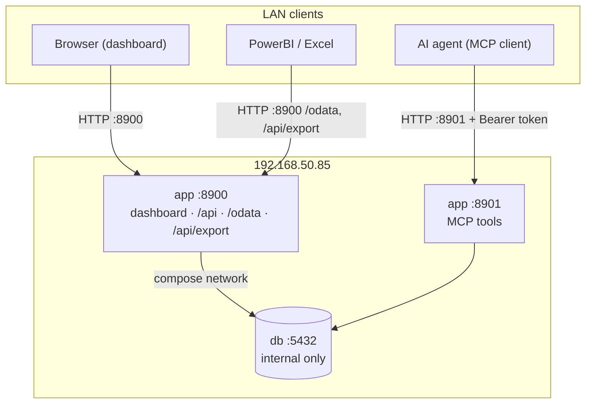
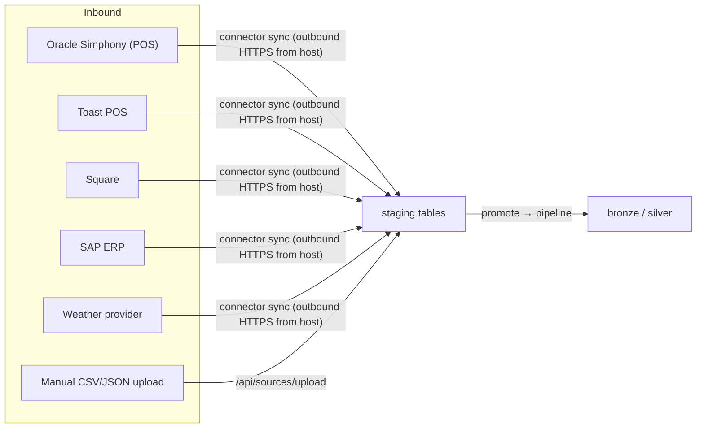

# Networking

Ports, hosts, protocols, and how data enters and leaves the platform. Use this when
configuring firewalls, connecting BI tools, or wiring up agents and connectors.

## Port map

The host at **192.168.50.85** runs several systems. Ports were chosen so the
sales‑forecast stack never collides with the others.

| System | Ports | Notes |
|--------|-------|-------|
| **sales‑forecast** | **8900** (API + dashboard), **8901** (MCP) | This platform. |
| traderific | 8800, 8801 | Separate system on the same host. |
| AURIX | 3000, 3001, 5500, 8000, 8001, 9001 | Separate system on the same host. |
| Postgres (`db` container) | 5432 *(internal)* | **Not** published to the host by default; only the `app` container reaches it over the compose network. |



> All listeners bind `0.0.0.0` inside the container. On a plain LAN that means anyone who
> can reach the host can reach 8900/8901 — see [Security posture](#security-posture).

## Endpoints exposed on :8900

| Path | Protocol | Purpose | Auth |
|------|----------|---------|------|
| `/` | HTTP/HTML | Dashboard SPA | Login required (session cookie) |
| `/api/*` | HTTP/JSON | Application API (analytics, forecast, anomalies, reports, settings…) | Session + role |
| `/api/auth/*` | HTTP/JSON | login · logout · me · signup · users | Open (login/signup) / admin (users) |
| `/api/health` | HTTP/JSON | Liveness + which backend/db are active | Open |
| `/odata/`, `/odata/$metadata`, `/odata/{entity}` | OData v4 | PowerBI/Excel feed | Open prefix (`/odata`) |
| `/api/export/{name}.csv` | HTTP/CSV | CSV feed for BI tools | Open prefix (`/api/export/`) |
| `/assets/{file}` | HTTP | Static assets (extension‑whitelisted) | Open prefix (`/assets/`) |

The auth middleware keeps a small **open list** (`/`, `/api/health`, the auth endpoints,
`/favicon.ico`) and **open prefixes** (`/assets/`, `/odata`, `/api/export/`); everything
else requires a valid session, and admin‑write routes additionally require the `admin`
permission.

## Store-node health listener (:8900)

Store-node health agents talk to the platform over three token-guarded open routes
(agents are not logged-in users; they present `X-Node-Token: <SF_NODE_TOKEN>` or
`Authorization: Bearer <SF_NODE_TOKEN>`):

| Route | Direction | Purpose |
|-------|-----------|---------|
| `POST /api/monitor/report` | agent → server | report service statuses + register presence |
| `GET /api/monitor/commands?store=…` | agent → server | claim pending remediation commands |
| `POST /api/monitor/command_result` | agent → server | confirm a command's outcome (done/failed) |

The host needs **inbound** :8900 reachable from the store subnets. When a store has a
**live agent**, an operator's remediation is **dispatched** to it (the agent runs a
whitelisted command and confirms); when no agent is present, remediation is **simulated**
server-side and the service is resolved. Where no agent reports health at all, status is
derived and correlated with detected anomalies. Leave `SF_NODE_TOKEN` blank only on a
trusted, isolated network. See `store_agent/` for the reference agent.

## MCP endpoint on :8901

Agents connect to the MCP server and must present the bearer token configured as
`SF_MCP_TOKEN` (leave it blank only on a trusted, isolated network).

```
URL:    http://192.168.50.85:8901/mcp
Header: Authorization: Bearer <SF_MCP_TOKEN>
```

Available tools: `list_stores`, `pipeline_status`, `forecast`, `top_anomalies`,
`buying_plan`, `ask`, `backtest`, `prep_plan` (read), plus write tools that require an
explicit `confirm=true`: `acknowledge_anomaly`, `approve_reorder`, `set_forecast_backend`,
`run_pipeline`. See [usage.md](usage.md#mcp-tools-for-agents).

## Data ingress — how data comes in



- **Connectors** (Simphony, SAP, Toast, Square, Weather) are configured on the **Sources**
  page. A *sync* makes an **outbound** call from the host to that provider's API/host —
  so the host needs egress to those endpoints (and any provider IP allow‑list needs the
  host's address).
- **File upload** is inbound to `/api/sources/upload`; the file lands in staging and is
  promoted into the warehouse by the pipeline.
- Connector configuration fields (host, port, tokens) are defined per connector in
  `app/sources/registry.py`; secret fields (client secrets, access tokens) are marked
  `secret` and stored server‑side.

## Data egress — how data leaves

| Consumer | How | Direction |
|----------|-----|-----------|
| **PowerBI / Excel** | OData feed `http://192.168.50.85:8900/odata/` and CSV `/api/export/*.csv` | Pull from BI tool → host :8900 |
| **Notifications** | Email (SMTP), Microsoft Teams / Slack **webhooks** | Outbound from host to mail server / webhook URLs |
| **AI report / Ask explanations** | Optional external LLM endpoint (configured in Settings) | Outbound HTTPS from host to the LLM API |
| **AI agents** | MCP tools | Pull from agent → host :8901 |

For notifications and the LLM endpoint the host needs **outbound** access to those
services (SMTP port, the Teams/Slack webhook host, the LLM API host).

## Firewall guidance

| Rule | Recommendation |
|------|----------------|
| Inbound 8900 | Allow from the analyst/BI subnet only. Prefer fronting with a TLS proxy and exposing 443 instead. |
| Inbound 8901 | Allow only from hosts that run MCP agents; require `SF_MCP_TOKEN`. |
| Inbound 5432 | Keep **closed** to the host — Postgres is internal to the compose network. Only open it (read‑only role) if PowerBI must connect directly to the DB instead of via OData. |
| Outbound | Permit egress to: connector provider APIs, the SMTP server, Teams/Slack webhook hosts, and the LLM endpoint. |

## Security posture

- **Plain HTTP on the LAN.** The app serves HTTP; RBAC credentials and the MCP bearer
  token are therefore sent in **cleartext**. For anything beyond a trusted LAN, put a
  **TLS reverse proxy** (nginx/Caddy) in front and terminate HTTPS there.
- **Sessions** are opaque tokens in an **HttpOnly** cookie, expiring after 12 hours.
- **Least privilege** — expose the minimum ports; keep Postgres internal; scope inbound
  rules to the subnets that actually need each port.
- **Secrets** (`POSTGRES_PASSWORD`, `SF_MCP_TOKEN`, connector tokens, LLM key) live in
  `deploy/.env` on the host, which is gitignored and never committed.

## Related docs

- Deploy topology and the compose stack → [deployment.md](deployment.md)
- What the endpoints return → [usage.md](usage.md)
