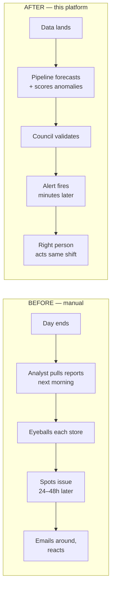
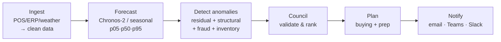
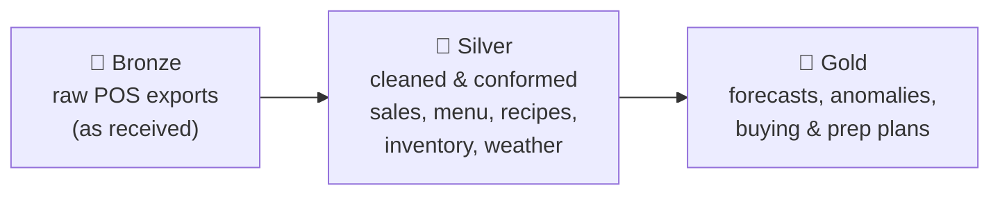
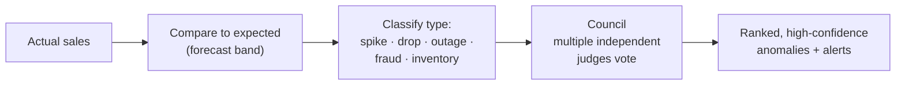
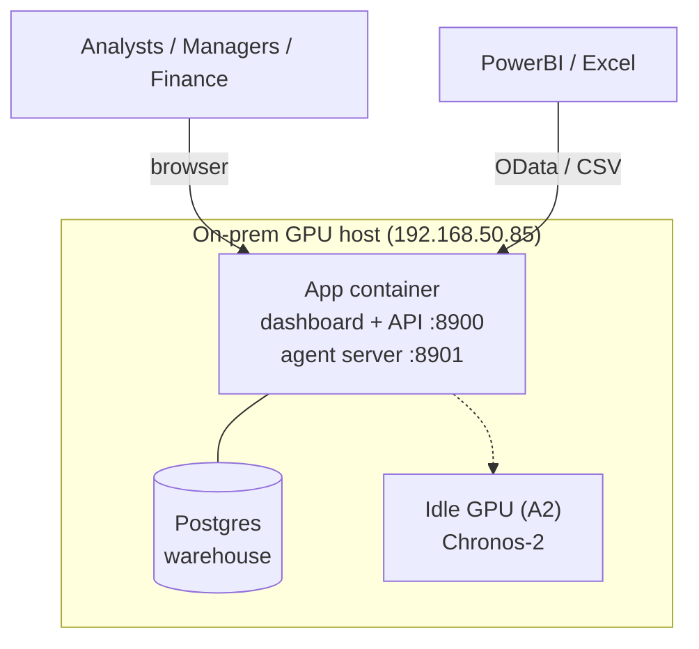

<!--
PowerPoint presentation TEMPLATE (Markdown source)
==================================================
How to use this file:
  • Each "---" divider is ONE slide. Titles are "#"/"##"; bullets are the on-slide copy.
  • "Speaker notes" blocks are what the presenter says — paste into PowerPoint's Notes pane.
  • "Layout" / "Visual" hints tell you what to draw or which template to pick.
  • Replace every [BRACKETED] placeholder with your real name/date/numbers before presenting.
  • Mermaid diagrams are provided as source — export them to PNG/SVG (mermaid.live) and drop
    the image on the slide, since PowerPoint doesn't render Mermaid natively.
  • This is also Marp/Deckset-compatible if you'd rather render straight to slides.

Deck length: ~16 slides / 20–25 min + Q&A. Trim the "How it works" section for an exec-only cut.
-->

# Faster Sales Anomaly Detection & Forecasting
### From 24–48 hours to near–real time

**[Presenter name] · [Team] · [Date]**

<!-- Layout: Title slide. Big product name, subtitle, KFC Vietnam branding. -->
> Speaker notes: Set the frame in one sentence — "Today I'll show how we cut anomaly
> detection from a day-and-a-half of manual report review down to minutes, and what that's
> worth to the business." Keep it short; the problem slide does the real setup.

---

## The problem

**Sales forecasting & anomaly detection for restaurant performance.**

- Operations and Finance detect sales anomalies **only after manual daily report reviews**.
- That review typically lands **24–48 hours after the issue occurred**.
- By the time we see it, the money — and the chance to intervene — is often already gone.

> **How can we detect and report faster?**

<!-- Layout: Problem statement front-and-center. Quote the last line large. -->
> Speaker notes: Read the problem statement verbatim — this is the mandate. Emphasize the
> lag: a POS outage, a fraud pattern, or a stockout that starts Monday morning isn't seen
> until Tuesday or Wednesday. Ask the room: "What does a 36-hour blind spot cost us?"

---

## Why the delay hurts

The lag isn't just slow reporting — it's **lost recovery time** on issues that compound hourly.

| Issue type | What happens in the blind spot | Cost of a 24–48h delay |
|------------|-------------------------------|------------------------|
| **POS / register outage** | Sales silently stop at a store | A full day of unrecorded/lost revenue |
| **Void / comp fraud** | Refund & discount abuse continues | Losses accrue every shift until caught |
| **Stockout** | Best-sellers unavailable | Missed sales + walked customers |
| **Demand spike/drop** | Under/over-staffing & prep | Waste or poor service, both margin hits |

- Manual review **doesn't scale** — more stores = more reports = longer lag.
- Analysts spend time **finding** problems instead of **fixing** them.

<!-- Visual: A simple timeline: "Issue occurs → …24–48h… → Detected → React". Shade the gap red. -->
> Speaker notes: The point of this slide is that the delay is a *financial* problem, not a
> reporting inconvenience. Each row is a real anomaly type our system detects. Land the
> scaling point: manual review gets worse as the chain grows.

---

## What we built

An automated platform that **forecasts demand, watches every store continuously, and alerts
the right person the moment something looks wrong.**

- **Forecasts** demand per store × item × daypart (14 days ahead).
- **Detects anomalies** — outages, fraud, stockouts, spikes/drops — automatically.
- **Validates** each anomaly with a multi-judge "council" to cut false alarms.
- **Acts**: turns forecasts into buying & prep plans, and **pushes alerts** (email/Teams/Slack).
- **Surfaces** everything in an 11-page dashboard, natural-language querying, and BI feeds.
- **Localized** for Vietnam: EN/VI, VND, and local demand drivers (Tết, holidays, new-store ramp).

<!-- Layout: 2x3 icon grid — Forecast, Detect, Validate, Act, Surface, Localize. -->
> Speaker notes: This is the "what" in six words: forecast, detect, validate, act, surface,
> localize. Don't go deep yet — the next section explains how. Stress that it's not a report;
> it's an always-on system.

---

## Before vs. after

- **From 24–48 hours → minutes** after data lands.
- **From manual, per-store review → automatic, chain-wide** monitoring.
- **From "find the problem" → "act on the problem."**

<!-- Visual: Export the mermaid diagram as an image. Or rebuild as two swim-lanes. -->
> Speaker notes: This is the money slide for the problem statement. Walk the two lanes
> left-to-right. The top lane is today; the bottom is what we deliver. The compression of
> that red gap is the whole pitch.

---

## How it works — the pipeline

Every run refreshes the whole chain, end to end:

- Runs **nightly** (or on-demand) and can run **more frequently** as data arrives.
- Each stage writes to the warehouse; the dashboard reads the results instantly.
- Fully **reproducible** — every run rebuilds outputs from source data.

<!-- Layout: One horizontal pipeline graphic (export mermaid). Keep bullets to 3. -->
> Speaker notes: Semi-technical audience — walk the six stages once. Emphasize that
> detection is not a separate manual step; it's baked into the same automated run that
> produces the forecast. "Faster" comes from removing the human from the *detection* loop.

---

## How it works — data foundation

A **medallion warehouse** turns messy POS exports into trustworthy analytics.

- **Bronze → Silver → Gold**: raw → cleaned → business-ready.
- Full **lineage & freshness** are visible in-app — you can always trace a number to its source.
- Sources today: Oracle Simphony, SAP ERP, Toast, Square, weather feeds, and manual CSV upload.

<!-- Visual: Three stacked "medallion" tiers. Bronze/silver/gold color coding. -->
> Speaker notes: Trust is the subtext here. Finance will ask "can I believe these numbers?"
> — the answer is the lineage view: every gold figure traces back through silver to the raw
> bronze export, with timestamps.

---

## How it works — the forecast engine

Prediction with honest uncertainty, not a single guess.

- **Chronos-2** foundation model (GPU) for accuracy; a **zero-dependency seasonal model** as
  an always-available fallback — same interface, so nothing downstream changes.
- Every forecast is a **range**: p05 (low) · p50 (expected) · p95 (high) — the band tells you
  how confident to be.
- **Restaurant-aware inputs**: weather, day-of-week, promotions, and **Vietnam demand drivers**
  — Tết multi-week regime, Women's/Children's/Teachers' Day, Mid-Autumn — plus a **new-store
  maturation** ramp.

**Validated accuracy (backtest on our data):**

| Metric | Result | Read as |
|--------|--------|---------|
| MAPE | **~22%** | typical error as % of actual |
| Band coverage | **~89%** | actuals land inside p05–p95 as designed (~90%) |
| Skill vs. naive | **+36%** | 36% less error than "same as last week" |

<!-- Visual: A forecast line chart with a shaded p05–p95 band and an actual overlay. -->
> Speaker notes: Two ideas: (1) uncertainty is a feature — the band is what makes anomaly
> detection possible; (2) these accuracy numbers are from holding out real data and
> scoring, not marketing. The band directly powers the anomaly detector on the next slide.

---

## How it works — anomaly detection

If actual sales fall outside what the model expected, we flag it — then **prove it's real**.

- Detects **outages** (sales stopped), **fraud** (void/comp abuse), **stockouts**, and demand
  **spikes/drops**.
- A **council** of independent checks must agree before something is surfaced as
  high-confidence — this keeps alert fatigue down.
- Each anomaly is **click-to-inspect**: see the anomalous day against the normal pattern.

**Detection quality:** precision **1.0** across types; near-perfect recall on outage/fraud/inventory.

<!-- Visual: The mermaid flow, or a chart with one red out-of-band point highlighted. -->
> Speaker notes: The council is the credibility story — we're not going to spam managers
> with noise. Precision 1.0 means when it alerts, it's right. That's what earns the trust to
> let it notify people automatically.

---

## From detection to action

Detecting faster only matters if the **right person acts**. The platform closes that loop.

- **Automated alerts** route to **email, Microsoft Teams, or Slack** by rule and severity.
- **Buying plans**: par levels, reorder points, and suggested order quantities (in ₫).
- **Prep plans**: thaw/cook lead-time board so stores are ready for forecast demand.
- **Agent-ready (MCP)**: AI agents can query forecasts/anomalies and take guarded actions
  (acknowledge, approve reorder) with confirmation + audit logging.

<!-- Layout: Left = "Detect", arrow, Right = "Act" with the four bullets as chips. -->
> Speaker notes: This answers "…and report faster" in the problem statement. The system
> doesn't just find the issue — it tells the accountable person on the same shift and hands
> them the recommended action.

---

## Using it — the dashboard

One place for analysts, managers, and Finance — no SQL required.

- **Dashboard**: chain-wide snapshot, 90-day trend + 14-day forecast, click-to-drill everywhere.
- **Forecast Explorer**: per-item prediction with a **Backtest-vs-actual** overlay to build trust.
- **Anomalies**: triage by type and confidence; inspect any event in context.
- **Ask**: type a plain-English question, get a table (the SQL is shown).
- **Reports**: 12 ready templates + an **AI-written executive summary**; export CSV / PDF.
- **In-app help** on every page and full **EN/VI** localization.

<!-- Visual: A screenshot of the live dashboard (192.168.50.85:8900). Annotate 2–3 areas. -->
> Speaker notes: Drop a real screenshot here. If time allows, this is the slide to switch to
> a 60-second live demo: open an anomaly, show the drill-in, then the backtest overlay.

---

## Infrastructure

Runs on our own hardware, alongside existing systems, with no new cloud spend.

- **Docker Compose** stack: app + bundled Postgres; one-command deploy via `deploy.sh`.
- **Env-switched**: same code runs on a laptop (SQLite + fallback) and on the server
  (Postgres + Chronos-2 GPU).
- **Isolated & safe**: pinned to an **idle GPU** so it never contends with other production
  workloads on the host.

<!-- Visual: Export the mermaid topology, or a simple 3-box server diagram. -->
> Speaker notes: Two reassurances for IT/Finance: (1) no new cloud bill — it uses spare
> capacity on hardware we own; (2) it's isolated so it can't disturb other systems. Mention
> the fast, repeatable deploy.

---

## Security & access

Right data, right people, with an audit trail.

- **Role-based access control**: admin · manager · analyst · viewer — the UI and API both enforce it.
- New sign-ups start as **pending** until an admin approves them.
- **Sessions** are short-lived, secure cookies; passwords are hashed (PBKDF2).
- **Guarded actions**: any write (approve reorder, run pipeline) requires explicit confirmation.
- Production note: front with **TLS** for anything beyond the trusted LAN.

<!-- Layout: A 4-row role table (role → what they can do). -->
> Speaker notes: Finance data needs governance. Roles mean viewers can't change anything and
> only admins touch settings/users. The TLS note shows we know the hardening path for a wider
> rollout.

---

## Expected outcomes — measured

The five official success metrics, live on the **Dashboard → Success-metric scorecard**:

| # | Success metric | Target | Delivered |
|---|----------------|--------|-----------|
| 1 | Forecast accuracy (daily store-level MAPE) | ≤ 10% | **9.1%** |
| 2 | Anomaly precision (ops-confirmed actionable) | ≥ 80% | **ops feedback loop** live; 1.0 statistical prior |
| 3 | Time-to-detect | < 2h (from 24–48h) | **~1.0h** (intra-day scheduler) |
| 4 | Analyst time saved | ≥ 70% / ~2 days/mo | **100%** auto-attributed; ~1–2 days/mo |
| 5 | Driver analysis coverage | ≥ 3 factors/anomaly | **100%** ship ≥3 drivers |

<!-- Layout: This IS the scorecard. Screenshot the live dashboard card, or use this table. -->
> Speaker notes: Walk the five official metrics and our number against each. Be honest:
> #2 populates as ops confirms anomalies; #3/#4 are mechanism/model-driven and improve at
> 250-store scale. See documents/gap-analysis.md for the full mapping + caveats.

---

## Business value

**Turning a 24–48h blind spot into a same-shift response — at chain scale, with no added headcount.**

| Value lever | How the platform delivers it | Illustrative impact* |
|-------------|------------------------------|----------------------|
| **Faster loss prevention** | Outages & fraud caught in minutes, not days | Recover [X] hours of lost sales per incident |
| **Less shrink / fraud** | Void-comp abuse flagged automatically | Cut fraud losses by [Y]% |
| **Fewer stockouts & less waste** | Forecast-driven buying & prep | [Z]% less waste; fewer missed sales |
| **Analyst productivity** | Automated monitoring replaces manual review | Redeploy [N] analyst-hours/week to action |
| **Scales with the chain** | Every store watched automatically | No new headcount as stores are added |
| **Better decisions** | Same-store-sales, VN drivers, BI feeds | Faster, evidence-based Ops & Finance calls |

\* *Replace bracketed figures with your validated numbers. Model performance is already
validated: ~22% MAPE, ~89% band coverage, +36% skill vs. naive, anomaly precision 1.0.*

<!-- Layout: Value table as the hero. Consider a single big stat callout: "24–48h → minutes". -->
> Speaker notes: This is the slide leadership remembers. Lead with the headline: detection
> time collapses from a day-plus to minutes. Then walk the levers. Be honest that dollar
> figures are to be validated with Finance, but the *model* performance is already proven.

---

## The road ahead

Built for MVP today; designed to grow.

- **Real-time ingestion**: move from nightly to near-streaming as POS feeds allow.
- **More channels**: add Zalo (VN) alongside email/Teams/Slack.
- **Deeper PowerBI**: curated semantic model on top of the existing OData/CSV feeds.
- **Wider rollout**: more stores, more regions — the architecture already scales.
- **Richer AI**: agent-driven investigation and auto-drafted incident summaries.

<!-- Layout: A simple now → next → later timeline. -->
> Speaker notes: Signal momentum and a plan. "Now" is live and delivering; "next" is
> incremental and low-risk on the same foundation. Invite the audience to prioritize which
> "next" item matters most to them.

---

## Summary & next steps

- The problem: anomalies found **24–48h late** via manual review.
- The solution: an **automated forecast + anomaly platform** that alerts in **minutes**.
- Proven model accuracy; running on our **own infrastructure**; governed by **RBAC**.
- **Business value**: faster loss prevention, less waste/fraud, freed analyst time, scales for free.

**Asks / next steps:**
1. [Confirm target stores for the next rollout wave]
2. [Validate business-value figures with Finance]
3. [Prioritize the roadmap item that matters most]

<!-- Layout: Recap + a clear 3-item ask. End with contact / demo link. -->
> Speaker notes: Close by restating the 24–48h → minutes headline, then make the ask
> concrete. Don't end on "questions?" — end on the decision you want them to make.

---

## Appendix — quick facts (backup slides)

- **Ports**: dashboard/API `:8900`, agent server `:8901`.
- **Forecast**: horizon 14 days; p05/p50/p95; Chronos-2 (GPU) or seasonal fallback.
- **Backtest**: MAE ~7.4 units, MAPE ~22%, band coverage ~89%, skill vs naive +36%.
- **Anomaly types**: spike · drop · outage · fraud (void/comp) · inventory; council-validated.
- **Roles**: admin · manager · analyst · viewer.
- **Data sources**: Simphony · SAP · Toast · Square · weather · CSV upload.
- **BI**: OData v4 feed + CSV endpoints for PowerBI/Excel.
- **Localization**: EN/VI, VND; VN driver days + Tết regime + new-store maturation.

<!-- Layout: Dense reference slide — only shown if asked. -->
> Speaker notes: Hold these in reserve for a technical Q&A. Full detail lives in the
> documents/ folder (architecture, deployment, networking, usage, how-to).
