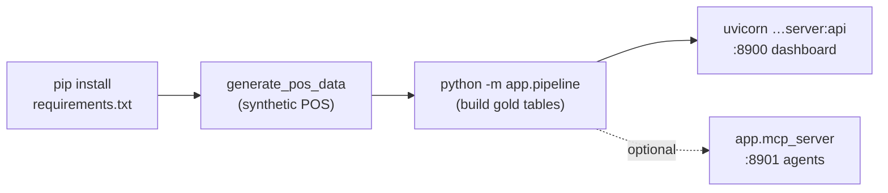

# Setup (local development)

Run the entire platform on your laptop with **zero infrastructure** — it defaults to
SQLite and the seasonal forecaster, so there's no database or GPU to install. This is
the fastest way to explore the code, generate test data, and see the dashboard.

> For the production install (Docker + Postgres + Chronos‑2 on the GPU host), see
> [deployment.md](deployment.md).

## Prerequisites

| Requirement | Notes |
|-------------|-------|
| **Python 3.11+** | The Docker image pins 3.11; local dev works on 3.11–3.14. |
| **pip / venv** | A virtual environment is strongly recommended. |
| **Git** | To clone and to push (repo: `github.com/coolkoo/sales-forecast`). |
| *(optional)* GPU + CUDA | Only needed to run the **real Chronos‑2** backend locally. |

## Quick start

```bash
git clone https://github.com/coolkoo/sales-forecast.git
cd sales-forecast

python -m venv .venv && source .venv/bin/activate
pip install -r requirements.txt          # core: FastAPI, SQLAlchemy, pandas, mcp…

# 1) Generate synthetic KFC Vietnam POS data (writes data/ + the SQLite db)
python -m data_generator.generate_pos_data

# 2) Run the full pipeline once (ingest → forecast → anomaly → inventory → prep)
python -m app.pipeline

# 3) Serve the dashboard + API
uvicorn app.api.server:api --host 0.0.0.0 --port 8900
#    open http://localhost:8900/

# 4) (optional) Serve the MCP server for agents, in another terminal
python -m app.mcp_server                 # listens on :8901
```

The first sign‑in uses a seeded demo account — **username `admin`, password `admin`**
(see [Roles](usage.md#roles--permissions); change these before any real use).



## What each step does

- **`data_generator.generate_pos_data`** — writes a realistic synthetic dataset (8 VN
  stores, Vietnamese menu, VND prices, weather, Tết/holiday driver days, new‑store
  maturation) into `data/` and the SQLite database. Safe to re‑run; it regenerates.
- **`app.pipeline`** — the batch job. `run_all()` drops & rebuilds the gold output
  tables, then runs each stage in order. Run a single stage with
  `python -m app.pipeline forecast` (or `ingest` / `anomaly` / `inventory` / `prep` / `alerts`).
- **`uvicorn app.api.server:api`** — the web service: it serves the dashboard SPA at
  `/` and the JSON API under `/api/*`.

## Configuration reference

All configuration is environment‑driven (`app/config.py`). Locally you can export vars
or drop a `.env` file in the repo root; on the server they live in `deploy/.env`.
Precedence: real environment variables win, then `.env`, then `deploy/.env`, then the
built‑in defaults below.

### Storage
| Variable | Default (local) | Purpose |
|----------|-----------------|---------|
| `SF_DATABASE_URL` | `sqlite:///sales_forecast.db` | Any SQLAlchemy URL. Server uses `postgresql+psycopg://…`. |

### Forecasting
| Variable | Default | Purpose |
|----------|---------|---------|
| `SF_FORECAST_BACKEND` | `seasonal` | `seasonal` (zero‑dep) or `chronos` (real Chronos‑2, needs GPU). |
| `SF_CHRONOS_MODEL_ID` | `amazon/chronos-2` | HuggingFace model id for the Chronos backend. |
| `SF_CHRONOS_DEVICE` | `cuda` | `cuda` \| `cuda:0` \| `cpu`. |
| `SF_FORECAST_HORIZON` | `14` | Days ahead to forecast. |
| `SF_FORECAST_LOOKBACK` | `365` | Days of history fed to the model. |
| `SF_USE_COVARIATES` | `true` | Use weather/holiday/promo/store‑age covariates. |
| `SF_MIN_HISTORY_DAYS` | `90` | Minimum history before a series is forecastable. |

### Anomaly detection
| Variable | Default | Purpose |
|----------|---------|---------|
| `SF_ANOMALY_BAND` | `0.90` | Forecast quantile band (p05–p95). |
| `SF_ANOMALY_LOOKBACK` | `45` | Days scored for residual anomalies. |
| `SF_VOID_COMP_Z` | `3.0` | Z‑threshold for void/comp (fraud) spikes. |
| `SF_INVENTORY_VARIANCE_PCT` | `0.20` | Absolute variance that flags an inventory anomaly. |

### Inventory / prep
| Variable | Default | Purpose |
|----------|---------|---------|
| `SF_PAR_WEEKS` | `1.5` | Par level = this many weeks of demand. |
| `SF_SERVICE_LEVEL_Z` | `1.28` | Safety‑stock z (≈90% service level). |

### Service / ports
| Variable | Default | Purpose |
|----------|---------|---------|
| `SF_API_HOST` | `0.0.0.0` | Bind address for the API/dashboard. |
| `SF_API_PORT` | `8900` | API + dashboard port. |
| `SF_MCP_PORT` | `8901` | MCP server port. |
| `SF_MCP_TOKEN` | *(empty)* | Bearer token clients must present to the MCP endpoint. Empty = auth disabled. |

## Running the real Chronos‑2 backend locally

Only if you have a CUDA GPU and want to validate the production forecaster:

```bash
pip install -r requirements-forecast.txt        # torch + chronos-forecasting
export SF_FORECAST_BACKEND=chronos
export SF_CHRONOS_DEVICE=cuda:0
python -m app.pipeline forecast
```

If no GPU is available, leave `SF_FORECAST_BACKEND=seasonal` — the seasonal backend
implements the **same contract** (p05/p50/p95 per series) so every downstream stage,
chart, and metric works identically; only accuracy differs.

## Troubleshooting

| Symptom | Fix |
|---------|-----|
| Dashboard loads but charts are empty | The pipeline hasn't populated the gold tables — run `python -m app.pipeline`. |
| `psycopg`/Postgres errors locally | You pointed `SF_DATABASE_URL` at Postgres; unset it to fall back to SQLite. |
| Chronos import errors | You set `SF_FORECAST_BACKEND=chronos` without `requirements-forecast.txt` — install it or switch back to `seasonal`. |
| Can't sign in | Use a seeded demo account (`admin`/`admin`); accounts created via **Sign up** start *pending* until an admin activates them. |

## Repository layout

```
sales-forecast/
├── app/
│   ├── api/server.py         # FastAPI app: dashboard + /api/* + /odata + auth/RBAC
│   ├── mcp_server.py         # MCP server (agent tools) on :8901
│   ├── pipeline.py           # ingest → forecast → anomaly → inventory → prep → alerts
│   ├── config.py             # env-driven configuration (SF_*)
│   ├── db.py                 # SQLAlchemy Core I/O (SQLite/Postgres)
│   ├── auth.py               # users, sessions, roles → permissions (RBAC)
│   ├── lake.py               # medallion lineage graph
│   ├── ingest/               # load + conform (bronze → silver)
│   ├── forecast/             # backends (chronos/seasonal), service, backtest, features
│   ├── anomaly/detect.py     # residual + structural anomalies
│   ├── council.py            # multi-judge anomaly validation
│   ├── inventory/            # planning (buying/par) + prep (thaw/cook)
│   ├── analytics/            # summary, pages, drill-down detail
│   ├── nlsql.py              # natural-language → SQL (Ask)
│   ├── reports.py, aireport.py   # 12 report templates + AI executive report
│   ├── feeds.py              # PowerBI OData + CSV feeds
│   ├── alerts.py             # email / Teams / Slack routing
│   ├── settings.py, jobs.py  # runtime settings + background pipeline runner
│   ├── sources/registry.py   # connector catalog (Simphony, SAP, Toast, Square, Weather, File)
│   └── dashboard/index.html  # the single-file SPA
├── data_generator/           # synthetic KFC-VN POS generator
├── deploy/                   # Dockerfile, docker-compose.yml, entrypoint.sh, deploy.sh, .env.example
├── documents/                # ← you are here
├── requirements.txt          # core deps
└── requirements-forecast.txt # Chronos-2 (GPU) overlay
```
