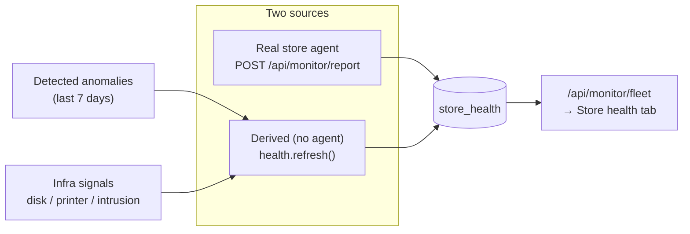

# Store health monitoring & remediation

A live health layer for the per-store nodes: it watches the services each restaurant
runs, correlates problems with detected sales anomalies, and lets operators **remediate**
the fixable ones — either simulated (for a demo) or **dispatched to a real store agent**
that runs the fix and confirms it.

Backend: `app/health.py`. Agent: `store_agent/`. UI: the **Store health** tab. APIs live
under `/api/monitor/*`.

## What it monitors

Each store node reports (or has derived) the status of eight services:

| Service | Watches | Remediation actions |
|---------|---------|---------------------|
| **POS terminals** | terminals online / responding | Restart POS service · Reboot terminal |
| **Back-office server** | disk %, CPU/load | Restart node agent · Clear temp/cache |
| **Network / uplink** | link, packet loss, latency | Fail over to LTE · Restart router |
| **Payment gateway** | connectivity, decline rate | Reconnect gateway |
| **Kitchen display (KDS)** | responsiveness | Restart KDS service |
| **Receipt printer** | spooler / online | Restart print spooler |
| **DB sync / backup** | last-sync freshness | Run sync now |
| **Security / access** | failed-login bursts, intrusion | Block source IP · Force-logout · Rotate credentials |

**Status levels:** `ok` · `remediating` · `warn` (Degraded) · `critical` · `down`.
A store's overall status is its **worst** service.

## Where health comes from



- **Agent-reported** (`source=agent`): a store node runs the agent and POSTs real service
  status. Agent-reported services are the source of truth and are never overwritten.
- **Derived** (`health.refresh()`): where no agent reports, status is computed and
  **correlated with anomalies detected in the last 7 days** — a `POS_OUTAGE` → POS `down`,
  a `CHANNEL_OUTAGE` (delivery/app) → network/payment degraded, `VOID_COMP_FRAUD` → a
  security alert — plus infrastructure signals (disk pressure, a stalled printer) and a
  **password-intrusion** signal (a failed-login burst from one IP). Issues are concentrated
  on a few "problem" stores so the majority of the fleet reads healthy.

`refresh()` runs at the end of each pipeline run and on every scheduler cycle (default
every 60 min), so the fleet view stays current with the anomaly picture.

## Remediation — dispatch vs. simulate

Remediation is **RBAC-gated to the `operate` role** (manager/admin); viewers/analysts are
read-only. When an operator triggers an action:

```mermaid
sequenceDiagram
  participant Op as Operator (dashboard)
  participant API as /api/monitor/remediate
  participant Q as node_command queue
  participant Agent as store agent (real or virtual)
  Op->>API: remediate(store, service, action)
  alt a live agent is present
    API->>Q: enqueue command; service → "remediating"
    Agent->>Q: GET /api/monitor/commands (claim)
    Agent->>Agent: run whitelisted command
    Agent->>API: POST /api/monitor/command_result (done)
    API-->>Op: service → "ok" (Resolved by node)
  else no agent
    API-->>Op: service → "ok" (simulated) + 24h hold
  end
```

- **Dispatch** (a live agent, including the demo virtual agent, is present): the action is
  queued, the service shows **Remediating…**, the agent executes and confirms, and the
  service resolves — the real command-channel flow.
- **Simulate** (no agent): the service is resolved server-side and held resolved for 24h,
  so the platform is useful before real agents are deployed.

Every action is written to an **audit log** (`health_event`) with the actor, and shown in
the store drawer and the event log. A remediated service isn't re-flagged for 24h.

### Demo virtual agent (`SF_DEMO_AGENT=1`)

For demos without physical hardware, a server-side **virtual agent** registers presence
for stores lacking a real one and auto-confirms dispatched commands after a few seconds —
so operators see the genuine **Remediating… → Resolved by node** lifecycle through the
real channel. Set `SF_DEMO_AGENT=0` in production once real agents are deployed (a real
agent's report always wins over the virtual one).

## The reference store agent (`store_agent/`)

A **stdlib-only** Python agent that runs on each store node (no dependencies to install).
Every cycle it **reports** local service status, **polls** for remediation commands,
runs **only whitelisted** commands, and **confirms** the outcome.

- **Probes:** disk/CPU, `ping` (loss/latency), `systemctl is-active <unit>`, and a
  failed-login/intrusion scan of `journalctl`/`auth.log` that surfaces the source IP.
- **Whitelist-only, safe by default:** `SF_AGENT_EXECUTE=0` dry-runs (logs what it *would*
  run) until you enable real execution. Actions map to fixed commands
  (`systemctl restart …`, `iptables … block_ip <ip>`, your `SF_CMD_*` scripts).
- **Auth:** presents `SF_NODE_TOKEN` to the listener.
- Ships `config.example.env`, a `systemd` unit, and a README (see [store_agent/README.md](../store_agent/README.md)).

Going live: drop `agent.py` on each node, set `SF_STORE` / `SF_NODE_TOKEN` and the unit &
command mappings, set `SF_AGENT_EXECUTE=1`, and set `SF_DEMO_AGENT=0` on the server.

## The Store health tab

- **Fleet tiles:** stores healthy / degraded / critical, services down, security alerts.
- **Store grid:** one card per store — a status stripe, an overall badge, the top issue,
  and a row of the eight service icons. Icons use the app's line-art style; a service with
  an issue turns **red**. Click a card to open its drawer.
- **Store drawer:** every service with its status, detail, and (for `operate` users) the
  remediation buttons. After a dispatch it animates **Remediating… → Node confirmed**.
- **Security & access panel:** stores with intrusion / failed-login signals.
- **Event log:** recent status changes, agent reports, and operator remediations.

In-app **? help** on the page explains all of this to a first-week analyst.

## API reference (`/api/monitor/*`)

| Route | Who | Purpose |
|-------|-----|---------|
| `GET /api/monitor/fleet` | view | Fleet summary + per-store rollup |
| `GET /api/monitor/store?store=…` | view | Per-service detail + recent events |
| `GET /api/monitor/events` | view | Recent health/remediation events |
| `POST /api/monitor/remediate` | **operate** | Trigger a remediation (dispatch or simulate) |
| `POST /api/monitor/report` | agent (node token) | Agent reports service statuses + presence |
| `GET /api/monitor/commands?store=…` | agent (node token) | Agent claims pending commands |
| `POST /api/monitor/command_result` | agent (node token) | Agent confirms a command's outcome |

## Data model

| Table | Holds |
|-------|-------|
| `store_health` | current status per (store, service): status, metric, detail, since, source, remediated_at |
| `health_event` | audit trail: reports, status changes, remediation requests/results |
| `node_agent` | agent presence registry (store, hostname, last_seen) |
| `node_command` | remediation command queue (pending → dispatched → done/failed) |

## Configuration

| Variable | Default | Purpose |
|----------|---------|---------|
| `SF_DETECT_INTERVAL_MIN` | `60` | Scheduler cadence (health refresh + anomaly scan) |
| `SF_DEMO_AGENT` | `true` | Virtual agent for the demo remediation flow |
| `SF_NODE_TOKEN` | *(empty)* | Token real agents present to the listener |

## Related

- Anomaly detection that drives correlation → [architecture.md](architecture.md#5-anomaly-detection--council)
- Ports / listener / node token → [networking.md](networking.md)
- The reference agent → [store_agent/README.md](../store_agent/README.md)
