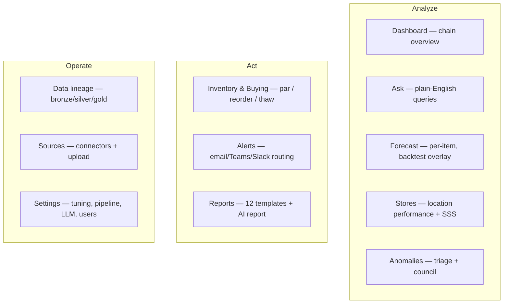
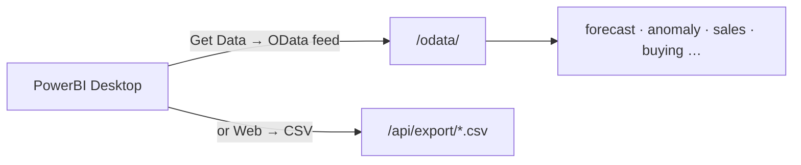

# Usage

How to use the platform day‑to‑day: the dashboard, the JSON API, the MCP tools, and the
BI feeds. For step‑by‑step task recipes, see [how-to.md](how-to.md).

## Signing in

Open `http://192.168.50.85:8900/` (or `http://localhost:8900/` locally). Sign in with a
seeded demo account or one an admin created for you. New **Sign up** accounts start as a
*pending viewer* until an admin activates them.

Use the **EN / VI** toggle (top‑right) to switch the whole app between English and
Vietnamese; all money is Vietnamese đồng (₫). Click the **?** in the top bar on any page
for built‑in, page‑specific help (what it is, how to read it, how to use it).

## Roles & permissions

| Role | Permissions | Can… |
|------|-------------|------|
| **admin** | view · operate · admin | Everything: Settings, LLM/alert config, user management. |
| **manager** | view · operate | Run the pipeline, sync sources, configure alerts. |
| **analyst** | view | Read all analytics, forecasts, and reports. |
| **viewer** | view | Read‑only (the default for new sign‑ups). |

The dashboard hides controls you can't use, and the API enforces the same rules
server‑side (a `view` user calling a write endpoint is rejected).

## The dashboard (12 pages)



| Page | What you do there |
|------|-------------------|
| **Dashboard** | Chain‑wide snapshot: KPI tiles, 90‑day trend + 14‑day forecast, weekday/daypart/category/store breakdowns. Everything is click‑to‑drill. |
| **Ask** | Type a question in plain language → read‑only SQL → **table + a chart** (say "in a pie chart" / "as a bar chart" / "over time" to pick the type). A deterministic rule engine answers common questions with zero config; **configure an LLM** (Settings → LLM endpoint) and it answers *any* data or correlation question across the whole warehouse. The SQL is always shown. |
| **Forecast** | Pick store × item × daypart. **View** toggles *Forecast (next 14d)* vs *Backtest vs actual* (overlays the real line + accuracy tiles: MAE, MAPE, band coverage, skill‑vs‑naive, bias). |
| **Stores** | Compare all locations; same‑store‑sales (YoY, like‑for‑like); open any store for detail. |
| **Anomalies** | Triage detected anomalies by type & council confidence; click one to inspect it in context. |
| **Store health** | Live per-store node service status (POS, server, network, payment, KDS, printer, DB sync, security). Click a store to inspect services and **remediate** (restart service, fail over, block IP…). Correlated with anomalies; security panel flags password-intrusion. *(remediation: operate)* |
| **Inventory & Buying** | Buying summary, par levels, reorder list (with ₫ cost), and the thaw/cook prep board. |
| **Alerts** | Configure channels (email/Teams/Slack) and rules; test; view the notification log. *(operate)* |
| **Reports** | Generate any of 12 templates; export CSV / print PDF; run the AI executive report. |
| **Data lineage** | See bronze→silver→gold tables, sources, freshness, and row counts. |
| **Sources** | Connect/sync data sources, upload CSVs, promote them, run the pipeline. *(operate)* |
| **Settings** | Forecast/pipeline tuning, LLM endpoint, and Users & roles. *(admin)* |

## The JSON API

Base URL `http://192.168.50.85:8900`. Responses are JSON. Authenticated routes need the
session cookie from `/api/auth/login`; open routes are noted below.

```bash
# Health (open) — confirms backend + database in use
curl -s http://192.168.50.85:8900/api/health

# Log in, keep the session cookie
curl -s -c cookies.txt -X POST http://192.168.50.85:8900/api/auth/login \
  -H 'Content-Type: application/json' -d '{"username":"admin","password":"admin"}'

# Use the cookie for authenticated calls
curl -s -b cookies.txt "http://192.168.50.85:8900/api/summary"
curl -s -b cookies.txt "http://192.168.50.85:8900/api/forecast?store=KFC-BH01&item=..."
curl -s -b cookies.txt "http://192.168.50.85:8900/api/forecast/hindcast?store=KFC-DN01&item=...&days=14"
curl -s -b cookies.txt "http://192.168.50.85:8900/api/anomalies"
curl -s -b cookies.txt "http://192.168.50.85:8900/api/backtest?horizon=14"
```

### Selected endpoints

| Area | Endpoints |
|------|-----------|
| Auth | `POST /api/auth/login` · `POST /api/auth/logout` · `GET /api/auth/me` · `POST /api/auth/signup` · `GET/POST /api/auth/users` |
| Overview | `GET /api/summary` · `GET /api/stores` · `GET /api/items` · `GET /api/analytics/summary` |
| Forecast | `GET /api/forecast` · `GET /api/forecast/store_daily` · `GET /api/forecast/hindcast` · `GET /api/backtest` |
| Analytics | `GET /api/analytics/{dow,daypart,category,top_items,stores,trend,breakdown,sss}` |
| Anomalies | `GET /api/anomalies` · `GET /api/anomaly_detail` |
| Inventory | `GET /api/buying` · `GET /api/prep` · `GET /api/prep/thaw` |
| Ask / catalog | `POST /api/ask` · `GET /api/catalog/search` |
| Reports | `GET /api/reports` · `GET /api/report/{name}` · `GET /api/report/{name}.csv` · `GET /api/report/ai` |
| Feeds (BI) | `GET /api/feeds/info` · `GET /api/export/{name}.csv` · `GET /odata/…` |
| Sources | `GET /api/sources` · `POST /api/sources/{connect,sync,upload,promote}` |
| Ops | `GET/POST /api/settings` · `POST /api/pipeline/run` · `GET /api/pipeline/status` · `GET /api/lineage` |
| Store health | `GET /api/monitor/fleet` · `GET /api/monitor/store` · `GET /api/monitor/events` · `POST /api/monitor/remediate` (operate) · `POST /api/monitor/report` (agent listener, node-token) |

## PowerBI / BI feeds

The warehouse is exposed for BI tools two ways — no database credentials needed:

- **OData v4:** connect PowerBI/Excel to `http://192.168.50.85:8900/odata/`. Discover
  entities via `/odata/$metadata`; each entity is `GET /odata/{name}`.
- **CSV:** `http://192.168.50.85:8900/api/export/{name}.csv` for a direct pull.

`GET /api/feeds/info` returns the live OData URL, the list of entities, the CSV URLs, and
the read‑only Postgres connection details (host/port/db) if you'd rather connect direct.
The Sources and Reports pages show these too.



## MCP tools (for agents)

Point an MCP client at `http://192.168.50.85:8901/mcp` with
`Authorization: Bearer <SF_MCP_TOKEN>`.

| Tool | Type | What it does |
|------|------|--------------|
| `list_stores` | read | List stores. |
| `pipeline_status` | read | Row counts / freshness of the gold tables. |
| `forecast(store, item, daypart, days)` | read | Forecast a series. |
| `top_anomalies(n, type)` | read | Highest‑priority anomalies. |
| `buying_plan(store, reorder_only)` | read | Reorder suggestions. |
| `prep_plan(store, daypart)` | read | Thaw/cook prep plan. |
| `ask(question)` | read | Natural‑language → SQL query. |
| `backtest(horizon)` | read | Accuracy metrics. |
| `acknowledge_anomaly(id, note, confirm)` | **write** | Acknowledge an anomaly (needs `confirm=true`). |
| `approve_reorder(store, sku, confirm)` | **write** | Approve a reorder (needs `confirm=true`). |
| `set_forecast_backend(backend, confirm)` | **write** | Switch seasonal/chronos (needs `confirm=true`). |
| `run_pipeline(confirm)` | **write** | Trigger a pipeline run (needs `confirm=true`). |

Write tools are guarded: they only act when called with `confirm=true`, and every action
is logged.

## Reading the forecast accuracy metrics

On the Forecast page's **Backtest vs actual** view and `/api/backtest`:

| Metric | Meaning | Good value |
|--------|---------|-----------|
| **MAE** | Average units the forecast is off. | Lower. |
| **MAPE** | Same error as a % of actual. | Lower (≈20% is typical here). |
| **Band coverage** | % of actual days inside p05–p95. | ≈ 90% (band is honest). |
| **Skill vs naive** | % less error than a "same as last week" guess. | Positive (model adds value). |
| **Bias** | Average signed error (over/under‑forecast). | Near 0. |

## Related docs

- Task recipes (add data, approve users, switch backend) → [how-to.md](how-to.md)
- Ports and feed URLs → [networking.md](networking.md)
