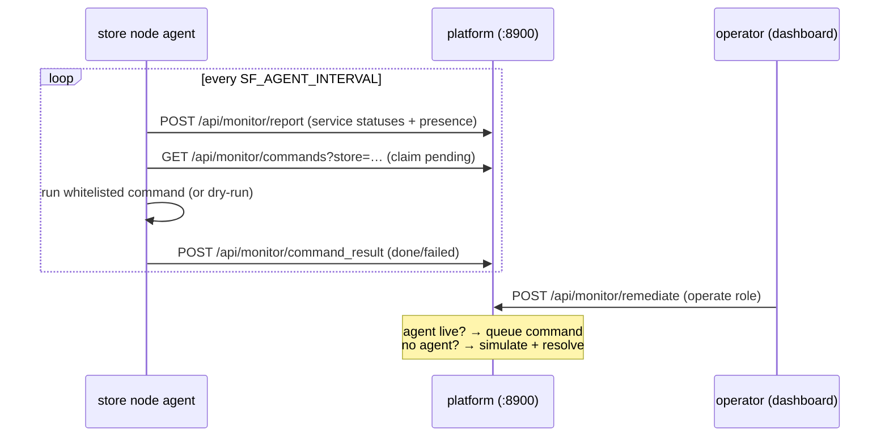

# Store-node health agent

A small, **stdlib-only** Python agent that runs on each store's back-office node. It
reports the health of local services to the platform and executes **whitelisted**
remediation commands dispatched by an operator from the **Store health** dashboard.



## What it monitors

| Service | Probe |
|---------|-------|
| POS terminals / KDS / printer / payment / backup | `systemctl is-active <unit>` (per `SF_UNIT_*`) |
| Back-office server (host) | disk usage + load average |
| Network / uplink | `ping` loss + latency to `SF_AGENT_GATEWAY` |
| Security / access | failed-login burst from `journalctl`/`auth.log` → flags the source IP (password-intrusion) |

## Remediation (whitelist-only, safe by default)

The agent will **only** run actions in its built-in `ACTION_COMMANDS` map — never arbitrary
input from the server. It starts in **dry-run** (`SF_AGENT_EXECUTE=0`): it logs and confirms
what it *would* run so you can watch the loop before enabling real execution.

| Action | Default command |
|--------|-----------------|
| `restart_pos` / `restart_kds` / `restart_spooler` / `reconnect_gateway` / `restart_agent` | `systemctl restart <unit>` |
| `block_ip` | `iptables -A INPUT -s <detected-ip> -j DROP` |
| `failover_lte`, `restart_router`, `run_sync`, `clear_temp`, `force_logout`, `rotate_creds`, `reboot_terminal` | your `SF_CMD_*` command (blank = "unsupported on this node") |

## Install

```bash
sudo mkdir -p /opt/sales-forecast-agent
sudo cp agent.py /opt/sales-forecast-agent/
sudo cp config.example.env /etc/sales-forecast-agent.env
sudo nano /etc/sales-forecast-agent.env      # set SF_STORE, SF_NODE_TOKEN, unit names

sudo cp sales-forecast-agent.service /etc/systemd/system/
sudo systemctl daemon-reload
sudo systemctl enable --now sales-forecast-agent
journalctl -u sales-forecast-agent -f        # watch it report + poll
```

Try it without installing (dry-run, reports to the server):

```bash
SF_STORE=KFC-HCM01 SF_API=http://192.168.50.85:8900 python3 agent.py
```

## Going live with real remediation

1. Confirm the dashboard shows the store as reporting (source **agent**) — remediation will
   then **dispatch** to the agent instead of simulating.
2. Fill in the `SF_UNIT_*` and `SF_CMD_*` values for this node.
3. Set `SF_AGENT_EXECUTE=1` and restart the service.
4. `block_ip` and `systemctl restart` need privilege — run as root (default unit) or grant the
   specific `sudo`/`polkit`/`CAP_NET_ADMIN` rights your security policy allows.

## Security

- Authenticates to the listener with `SF_NODE_TOKEN` (set the same value on the server).
- Runs over the LAN in plain HTTP — put a TLS reverse proxy in front for anything wider.
- Whitelist-only execution; the server can only trigger the fixed action ids, never raw commands.
